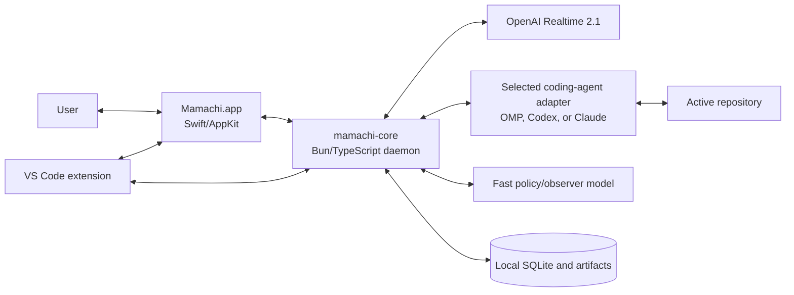
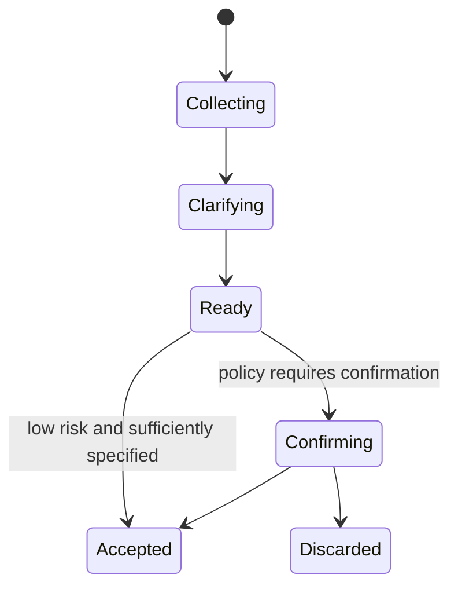
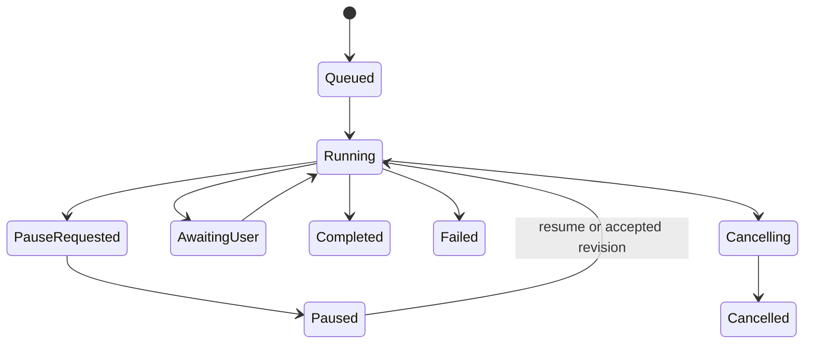
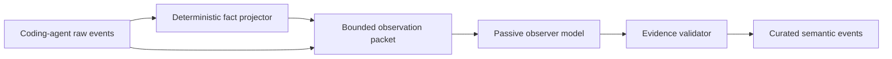

# Mamachi Product Requirements Document

**Status:** Initial product and architecture baseline  
**Date:** 2026-07-22  
**Audience:** Product, design, and engineering  
**Initial release:** Small invited macOS alpha

## 1. Summary

Mamachi is a local-first, voice-first coding agent harness. A realtime speech-to-speech model maintains a natural conversation with the user while a separate, explicitly selected coding agent—embedded Oh My Pi (OMP), Codex CLI, or Claude Code—performs repository work.

The speech model is a bridge, not a coder. It collects intent, starts or queues work, answers grounded status questions, relays questions in both directions, handles safe course corrections, and explains verified results. The coding agent retains full coding responsibility and may continue working while the user talks with Mamachi about the task or unrelated topics.

The product surface is a Wispr Flow-like macOS overlay with an expandable task drawer. The infrastructure runs locally, stores repository and orchestration state on-device, and reuses the selected coding agent’s existing authenticated account or an optional provider key.

## 2. Product thesis

Existing coding agents couple conversation to one coding loop. Users either wait for that loop, interrupt it to ask a question, or consume a raw tool trace. Mamachi separates these concerns:

- The voice companion optimizes for low-latency conversation and understandable coordination.
- The coding agent optimizes for correct repository work.
- A deterministic local controller owns task state, permissions, evidence, and handoffs.
- A passive observer model converts bounded coding evidence into useful semantic progress without influencing the coder.

This separation should make long coding tasks feel collaborative without allowing the conversational model to fabricate progress or accidentally modify code.

## 3. Product principles

1. **Conversation and execution are independent.** Coding continues while the user speaks.
2. **The controller is authoritative.** Model prose never changes task state.
3. **Speech is a projection, not a control plane.** Voice failures cannot corrupt coding work.
4. **The voice model never codes.** It has no shell, filesystem, Git, edit, or generic MCP tools.
5. **Ground every work claim.** Status and completion statements require local evidence.
6. **Act naturally, gate by consequence.** Low-risk actions may proceed; ambiguous or consequential actions require confirmation.
7. **Keep the source local.** Only provider-bound context leaves the machine.
8. **Do not commandeer the workspace.** No automatic commits, branch switches, file locks, or overwriting pre-existing user work.
9. **Prefer one clear execution path.** The alpha supports one active mutating coding job globally.
10. **Preserve user intent.** Task revisions are explicit, versioned, and attributable.

## 4. Target user and release

### 4.1 Initial user

A macOS user who works in VS Code and already uses Codex, Claude Code, or OMP. Setup must not assume familiarity with terminal installation, provider credentials, or Mamachi’s internal stack.

### 4.2 Alpha audience

A small invited group. The alpha must include:

- Signed and notarized macOS builds
- First-run microphone, notification, Accessibility, and editor integration setup
- macOS Keychain credential storage
- Local diagnostics export
- Durable schema migrations
- Crash recovery
- Safe defaults and an inspectable local audit trail

The alpha does not require accounts, hosted billing, a cloud control plane, or multi-device synchronization.

## 5. Decisions made

| Area | Decision |
|---|---|
| Interaction | Hybrid: a hotkey wakes or resumes a voice session; the microphone sleeps when disengaged |
| Dispatch | Adaptive by risk and task size |
| Coding context visible to voice | Curated semantic event stream with artifacts fetched on demand |
| Coding concurrency | One active coding job plus a global queue |
| Deployment | Local-first desktop application |
| Platform | macOS native first |
| Voice provider | OpenAI Realtime 2.1 behind a provider adapter |
| Coding backend | Explicit user choice: embedded OMP SDK, Codex CLI, or Claude Code |
| Coding-agent integration | Persist and resume the selected backend’s session; never silently fall back to another account |
| Mid-flight steering | Risk-aware: direct clarifications, confirmed consequential amendments, unrelated work queued |
| UI | Minimal overlay plus expandable task drawer |
| Coding permissions | Trust normal in-repository coding; escalate exact/high-impact effects |
| Memory | Persist confirmed task facts and explicit memories; full local transcript remains until manually cleared |
| Workspace targeting | Focused VS Code workspace, pinned repository fallback, visible repository chip |
| Prototype goal | Request-to-change, concurrent conversation/status, and safe course correction in one demo |
| Workspace mutation | Edit the current working tree directly; never auto-commit or switch branches |
| Editor context | Workspace may be inferred; file/selection/diagnostic/terminal content requires explicit capture |
| Credentials | Reuse existing coding-agent subscription logins; optional provider keys and the required voice key are stored in macOS Keychain |
| Voice posture | Adaptive companion |
| Editor integration | VS Code extension first, editor-neutral protocol underneath |
| Background completion | Visual notification while voice sleeps; spoken brief on resume |
| Progress semantics | Dedicated passive observer model, evidence constrained |
| Observer model | Configurable fast text model with no tools |
| Crash recovery | Recover paused and ask before resuming |
| Queue scope | One global queue; every task is pinned to a repository identity |
| Concurrent user edits | Detect and reconcile; pause only unresolved semantic conflicts |
| Coder questions | Answer from evidence first; ask the active coding agent at a safe boundary when supported |
| Handoff readiness | Adaptive to task size |
| Intent classifier | Hard rules plus a schema-constrained fast policy model |
| Confirmation channel | Voice for ordinary confirmation; visual card for exact/high-impact effects |
| Language | Mirror the user naturally; preserve technical identifiers and original wording |

## 6. Scope

### 6.1 Included in the first usable product

- Native macOS menu-bar app
- Global hotkey and resumable duplex voice session
- Floating overlay and task drawer
- OpenAI Realtime 2.1 voice adapter
- Local Bun/TypeScript orchestration daemon
- Embedded OMP `AgentSession` plus structured Codex CLI and Claude Code adapters
- Explicit coding-backend selection, authenticated-account detection, and resumable backend sessions
- One active coding task and a global queue
- Deterministic command/event controller
- Persistent SQLite event and task state
- Passive observer and policy model roles
- VS Code extension for workspace and explicit context capture
- Grounded status, blocker, decision, verification, and completion briefs
- Safe pause, amendment, replan, resume, and cancellation
- Direct current-working-tree edits with concurrent-change detection
- Keychain-backed credentials and local transcript history
- Visual high-impact approval cards
- Recovery after app or daemon restart

### 6.2 Explicit non-goals for the invited alpha

- Windows or Linux clients
- iOS or web clients
- Cloud workspaces or hosted repository execution
- Hosted accounts, billing, or provider proxying
- Compatibility with coding agents beyond OMP, Codex CLI, and Claude Code
- Multiple simultaneous mutating coding jobs
- Automatic branches, commits, pull requests, or worktree merging
- JetBrains, Xcode, Vim, or terminal plugins beyond basic foreground-app fallback
- A full IDE, embedded terminal, or complete raw agent trace viewer
- Always-on background microphone recording
- Local speech-to-speech inference
- Active reviewer agents that steer the coder without the user
- Automatic persistence of casual conversation as coding memory

## 7. Golden-path prototype

The first end-to-end demo must complete all of the following in one session:

1. The user focuses a VS Code workspace and invokes Mamachi with the hotkey.
2. The user discusses a real coding request.
3. Mamachi identifies the repository, gathers the minimum required intent, and dispatches or confirms according to policy.
4. The selected coding agent begins work and mutates the current working tree.
5. The user has an unrelated conversation with Mamachi while coding continues.
6. The user asks for status and receives an evidence-grounded brief.
7. The user changes a load-bearing requirement.
8. Mamachi requests a safe pause at the next tool boundary, summarizes impact, and confirms the revision.
9. The same coding-agent session replans and resumes under the new versioned task specification.
10. The coding agent verifies the result.
11. Mamachi speaks the result, verification, important caveat, and next review action.
12. The task drawer shows the task history, files changed, verification evidence, and deep links to exact files/ranges.

## 8. User experience requirements

### 8.1 Voice lifecycle

The voice experience is hierarchical rather than one large state enum:

- **Connection:** `offline | connecting | online | recovering`
- **Engagement:** `sleeping | engaged`
- **Turn:** `idle | listening | thinking | speaking`
- **Pending brief:** `none | queued`

Requirements:

- The global hotkey engages or resumes the session.
- Disengaging sleeps the microphone without stopping active coding work.
- Barge-in stops playback immediately and removes unheard assistant audio from provider conversation history.
- Background events never trigger speech automatically while disengaged.
- A completed task or blocker while sleeping creates a native notification and queues a spoken brief for resume.
- Raw audio is never persisted.
- Full text transcripts remain local until the user clears them.

### 8.2 Overlay

Collapsed overlay content:

- Listening/thinking/speaking/working state
- Waveform or activity visualization
- Live transcript
- Active repository chip
- Active coding task status
- Stop/disengage control

The overlay must be non-activating where possible and must not steal focus from the editor for routine use.

### 8.3 Task drawer

Expanded content:

- Current objective and task-spec revision
- Active phase and current grounded step
- Global queue and reorder controls
- Pending coder question or confirmation
- Permission/approval cards
- Decisions and blockers
- Changed-file summary
- Verification summary and evidence
- Run boundaries, including pause/recovery/replan
- Open-in-VS-Code links to files and ranges

The drawer is not an IDE and does not attempt to reproduce a raw coding-agent terminal interface.

### 8.4 Workspace targeting

Resolution order:

1. Focused VS Code workspace reported by the extension
2. Explicitly pinned repository
3. Spoken/project selection from known repositories

Rules:

- The target repository is always visible before dispatch.
- Low-confidence target changes require confirmation.
- Every created task stores an immutable repository identity and resolved path.
- Queue reordering never retargets a task.
- A missing or moved repository blocks the task instead of falling back to another focused workspace.

### 8.5 Explicit editor context

The workspace identity may be inferred automatically. Source content may cross into a request only through an explicit gesture or phrase such as “use what I’m looking at.” Supported alpha attachments:

- Active file
- Current selection
- Diagnostics for the active file
- Bounded terminal excerpt

Each attachment appears as a removable chip before dispatch and is stored by local artifact reference.

## 9. System architecture



### 9.1 Native macOS app

Responsibilities:

- Global hotkey and menu-bar lifecycle
- `AVAudioEngine` microphone capture and audio playback
- Barge-in and playback truncation timing
- Floating overlay and task drawer
- Native notifications
- Keychain and macOS permission UI
- Local daemon lifecycle and health presentation
- Approval cards

Implementation direction: Swift and AppKit, using SwiftUI selectively for view composition where it does not compromise overlay behavior.

### 9.2 Local core daemon

Responsibilities:

- Authoritative state machines
- Command validation and idempotency
- Global task scheduler and queue
- OpenAI Realtime adapter
- Selected coding-agent lifecycle, routing, event normalization, and session persistence
- Hard risk policy and fast policy-model invocation
- Raw-to-fact and fact-to-semantic event projection
- Observer evidence validation
- Persistence, replay, snapshots, migrations, and recovery
- Workspace/change attribution
- IPC for the native app and editor extension

Runtime: Bun 1.3.14 or newer.

### 9.3 Coding-agent adapters

Every backend implements the same controller contract: start or resume a task in the selected repository, emit normalized lifecycle and evidence events, stop at a safe process boundary, and persist its backend plus session identity. A task never migrates to another backend implicitly.

#### Embedded OMP

Use the pinned `@oh-my-pi/pi-coding-agent` package through `createAgentSession()`, session subscriptions, `prompt()`, `steer()`, `followUp()`, `abort()`, persistent sessions, and the pre-execution extension hook. Mamachi supplies the headless question adapter, policy hook, event projection, safe pause behavior, and structured user-query tool. Do not drive or scrape the OMP TUI.

#### Codex CLI and Claude Code

Launch the user’s installed, authenticated CLI non-interactively in the selected repository and consume its structured JSON event stream. Preserve the native account and sandbox/permission configuration, persist the returned session ID, resume that exact session after an accepted pause, normalize tool and completion evidence, and reconcile repository changes at every external process boundary. Never scrape human-oriented terminal output or fall back to another backend.

### 9.4 VS Code extension

Responsibilities:

- Report active workspace identity and active file metadata
- Capture selections, diagnostics, and bounded terminal excerpts only on explicit request
- Open file/range deep links
- Identify editor-originated saves for concurrent-edit attribution

The local protocol must remain editor-neutral so additional plugins can be implemented later.

### 9.5 Local IPC

Initial design:

- Unix-domain socket owned by the current user
- Length-prefixed frames
- Versioned JSON command/event payloads
- Binary audio frames on a distinct frame kind
- Per-launch authenticated handshake
- Reconnect from a durable event sequence

The canonical protocol package generates or exports JSON Schema. TypeScript consumes inferred types; Swift and the VS Code extension consume generated bindings. Hand-maintained duplicate DTOs are prohibited.

## 10. Conversation and coding separation

Starting coding must not remain an outstanding Realtime tool call.

`submit_task` validates the request, creates a durable task, and immediately returns a task ID and state. The selected coding agent runs independently. The Realtime model stays available for arbitrary conversation. Coding progress later enters the voice context through curated, replaceable system-state messages.

The voice model never receives:

- Shell access
- Filesystem read/write access
- Git access
- Coding-agent tools
- Generic MCP access
- Raw unbounded coding traces

## 11. Authoritative state model

### 11.1 Intent draft



An intent draft is mutable conversational understanding. It is not queued work.

### 11.2 Task



Task state rules:

- A task owns a versioned `TaskSpec`.
- Consequential amendment creates a proposed next revision.
- Accepting an amendment preserves prior revisions and creates a new run boundary.
- A run is one selected coding-agent execution segment under one task-spec revision.
- Verification is evidence attached to the task/run, not a model claim.
- Terminal states are immutable.

### 11.3 Crash recovery

On unexpected restart:

1. Persist `run.interrupted` when recovery begins.
2. Restore the selected backend, its exact session identity, and authoritative task/event state.
3. Inspect repository identity and workspace facts.
4. Mark the task `paused(reason: recovery)`.
5. Never replay an unknown in-flight tool call.
6. Ask the user before resuming.

## 12. Commands and events

Commands are requests. Events are immutable facts emitted only by the controller.

```ts
type Command = {
  id: string;                 // UUIDv7 and idempotency key
  type: string;               // imperative, for example task.requestPause
  actor: "user" | "voice" | "ui" | "vscode";
  expectedRevision?: number;
  payload: unknown;
};

type DomainEvent = {
  version: 1;
  id: string;
  seq: number;                // global durable sequence
  at: string;
  type: string;               // past tense, for example task.paused
  actor: "controller" | "policy" | "coder" | "voice" | "ui" | "vscode";
  projectId?: string;
  taskId?: string;
  runId?: string;
  correlationId: string;
  causedBy?: string;
  payload: unknown;
};
```

### 12.1 Delivery guarantees

- The daemon is the sole event-log writer.
- Commands are idempotent by ID.
- Consumers reconnect with `afterSeq`.
- The daemon returns a snapshot at sequence `n`, followed by events after `n`.
- Delivery is at least once; consumers deduplicate by event ID.
- Large content remains in local artifacts and is referenced from events.
- Provider payloads terminate at adapters and never become public protocol contracts.

### 12.2 Domain event catalog

Intent and policy:

- `intent.updated`
- `intent.confirmationRequested`
- `intent.accepted`
- `policy.decisionRecorded`
- `approval.requested`
- `approval.resolved`

Task lifecycle:

- `task.created`
- `task.enqueued`
- `task.started`
- `task.phaseChanged`
- `task.pauseRequested`
- `task.paused`
- `task.amendmentProposed`
- `task.specRevised`
- `task.resumed`
- `task.awaitingUser`
- `task.completed`
- `task.failed`
- `task.cancelled`

Grounded work:

- `plan.updated`
- `step.started`
- `step.completed`
- `decision.recorded`
- `blocker.raised`
- `blocker.resolved`
- `workspace.filesChanged`
- `verification.started`
- `verification.completed`
- `artifact.created`

Conversation:

- `voice.engaged`
- `voice.disengaged`
- `voice.turnStarted`
- `voice.turnInterrupted`
- `voice.turnCompleted`
- `brief.queued`
- `brief.delivered`

Recovery and concurrency:

- `run.interrupted`
- `workspace.changeObserved`
- `workspace.overlapDetected`
- `workspace.agentEditRejectedAsStale`
- `workspace.reconciled`
- `workspace.conflictRaised`

## 13. Passive observer pipeline



### 13.1 Observer authority

The observer may classify phase, summarize progress, identify a decision or blocker, and assign importance. It may not:

- Change task state
- Send messages to the active coding agent
- Call tools
- Read arbitrary repository content
- Declare tool success without a matching result
- Declare verification without matching command/evidence
- Declare completion

### 13.2 Observer output

```ts
type ObserverAnnotation = {
  phase: "understanding" | "planning" | "implementing" | "verifying" | "reviewing";
  summary: string;
  importance: "routine" | "notable" | "attention";
  evidenceIds: string[];
  decision?: { summary: string; evidenceIds: string[] };
  blocker?: { summary: string; evidenceIds: string[] } | null;
  confidence: number;
};
```

Every semantic claim requires valid evidence IDs from the supplied packet. Invalid or missing evidence downgrades the output to a private diagnostic.

### 13.3 Observer triggers

Invoke on meaningful boundaries, not token deltas:

- Plan/todo change
- Tool batch completion
- OMP turn end
- Long quiet interval during active work
- User status query
- Coder question or blocker
- Run completion candidate

If the observer is unavailable, status falls back to deterministic facts and explicitly states that semantic detail is unavailable. Coding continues unaffected.

## 14. Policy model and adaptive dispatch

Two isolated logical fast-model roles may share the same configured physical model:

- `policy`: task size, ambiguity, semantic risk flags, missing fields, confidence
- `observer`: evidence-bound progress annotations

Hard controller rules always override either model.

### 14.1 Handoff readiness

- Small/obvious task: target repository, concrete change, and observable completion are sufficient.
- Feature/broad task: require objective, acceptance criteria, and hard constraints.
- Ambiguous/high-impact task: clarify or confirm before dispatch.
- Low confidence: use the more conservative path.

Implementation details remain the coding agent’s responsibility. The voice companion should not interrogate the user about files or architecture that the selected agent can discover safely.

### 14.2 Confirmation tiers

| Tier | Examples | Required action |
|---|---|---|
| Automatic | Read-only status, explicit context capture, sufficiently specified small in-repo task | Execute and report result |
| Voice confirmation | Broad task, meaningful scope expansion, architectural amendment, low-confidence workspace switch | Summarize and obtain one explicit confirmation |
| Visual approval | Destructive command, credential disclosure, external publication/deployment, purchase, out-of-repo write/access | Show exact target and consequence in a card |
| Reject | Stale confirmation, invalid task/repository, unsupported action, policy violation | Explain and offer a safe next step |

A confirmation is single-use, revision-bound, and applies only to its summarized action. Changed terms require a new proposal.

## 15. Voice model contract

### 15.1 Role and behavior

Mamachi is concise and operational around coding, warm and conversational elsewhere. It asks one question at a time and reports only important events:

- Blockers
- Consequential decisions
- Requested milestones/status
- Completion

It does not narrate routine tool activity.

### 15.2 Grounding

- The controller is authoritative for workspace, tasks, queue, permissions, progress, artifacts, and completion.
- Mamachi may state a transition only after a successful tool result or controller-injected event.
- It must preserve uncertainty.
- It must not provide percentages or completion-time estimates.
- Tool timeout means unknown outcome; query by idempotency key rather than retrying.

### 15.3 Conversation versus operation

- Brainstorming, examples, hypotheticals, and side discussions are non-operative.
- An actionable request becomes an intent draft.
- The controller decides readiness, risk, and confirmation.
- Casual conversation never enters task context unless explicitly acted upon.

### 15.4 Language and audio

- Mirror the language of the addressed utterance.
- Preserve model names, paths, symbols, commands, and quoted requirements verbatim.
- Do not switch languages because of background speech.
- Ask for repetition or spelling when an exact identifier is unclear.
- If audio is silence, noise, media, or speech not addressed to Mamachi, call `wait_for_user` and remain silent.
- On barge-in, stop immediately and treat the new utterance independently; do not infer cancellation.

### 15.5 Realtime runtime

- Use OpenAI Realtime 2.1 through an adapter.
- Keep VAD enabled.
- Disable automatic response creation.
- Trigger `response.create` only for a user turn or a controller-authorized proactive brief.
- Insert curated state as replaceable system conversation items without triggering a response.
- Compact long sessions from the local transcript while preserving confirmed task facts separately.

## 16. Voice tool contract

The tool list is narrow and strict. Every schema rejects additional properties.

```ts
wait_for_user({})

get_workspace({
  view: "active" | "available"
})

list_coding_profiles({})

capture_editor_context({
  kinds: ("active_file" | "selection" | "diagnostics" | "terminal_excerpt")[]
})

submit_task({
  repositoryId: string,
  objective: string,
  acceptanceCriteria: string[],
  constraints: string[],
  attachmentIds: string[],
  codingProfileId: string | null
})

get_task_status({
  taskId: string | null,
  view:
    | "brief"
    | "current_step"
    | "plan"
    | "queue"
    | "changes"
    | "verification"
    | "decisions"
})

get_task_artifact({
  taskId: string,
  artifactId: string,
  view: "summary" | "bounded_excerpt"
})

answer_task_question({
  requestId: string,
  answer: string
})

ask_coder({
  taskId: string,
  question: string
})

propose_task_change({
  taskId: string,
  change: string,
  desiredOutcome: string | null,
  addedConstraints: string[]
})

control_task({
  taskId: string,
  action: "pause" | "resume" | "cancel"
})

manage_queue({
  taskId: string,
  operation: "move_first" | "move_last" | "move_before" | "move_after",
  anchorTaskId: string | null
})

resolve_confirmation({
  confirmationId: string,
  decision: "approve" | "reject"
})

remember_fact({
  scope: "global" | "project",
  projectId: string | null,
  fact: string
})

forget_fact({
  memoryId: string
})
```

Mutating tools return:

```ts
type ActionResult =
  | { status: "accepted"; eventId: string; taskId?: string }
  | { status: "confirmation_required"; confirmationId: string; summary: string }
  | { status: "rejected"; code: string; explanation: string }
  | { status: "conflict"; currentRevision: number; explanation: string };
```

`submit_task` has no model-supplied risk field. `propose_task_change` has no model-supplied clarification/safety bypass. The controller owns both decisions.

## 17. Mid-flight steering

Utterance outcomes:

- `CHAT`
- `STATUS_QUERY`
- `CLARIFY_ACTIVE`
- `AMEND_ACTIVE`
- `ENQUEUE`
- `PAUSE`
- `CANCEL`

Behavior:

- An answer to an outstanding coder question resolves that exact request.
- A safe clarification uses a live session steering API when the selected backend supports one.
- A non-urgent addition uses the backend’s follow-up mechanism when available or becomes queued work.
- A consequential amendment sets `pauseRequested`.
- Embedded OMP blocks at its pre-execution hook; external CLIs stop at the supervised process boundary.
- State and session identity are persisted, impact is summarized, and a new task-spec revision is confirmed before resume.
- Emergency stop aborts the embedded session or terminates the selected external process.

## 18. Concurrent workspace changes

Mamachi never locks files.

- VS Code reports user saves.
- Normalized coding-agent tool events and external-turn baselines identify coder writes.
- Filesystem watching catches formatters and unknown processes.
- The controller tracks content identities for the coder’s read/write set.
- A stale anchored agent edit fails and forces the coding agent to reread.
- An overwrite of an existing file whose identity changed since observation is blocked.
- The selected coding agent attempts reconciliation.
- Only an unresolved semantic conflict transitions the task to `awaitingUser`.

Pre-existing user changes are never attributed to the agent and must not be overwritten merely to restore a baseline.

## 19. Persistence and privacy

### 19.1 Local data

Persist locally:

- Repositories and workspace identities
- Voice transcript history until manually cleared
- Intent drafts and task-spec revisions
- Commands, domain events, and approvals
- Run state and recovery metadata
- Curated observations and evidence references
- Artifact metadata and bounded local artifacts
- Confirmed task facts and explicit memories

Do not persist:

- Raw microphone audio
- Unbounded duplicate copies of coding-agent tool output
- Casual conversation as coding memory without explicit capture

### 19.2 Credentials

- Reuse existing Codex, Claude Code, and OMP account logins without copying their tokens into Mamachi.
- Store only explicitly supplied provider credentials in macOS Keychain; pass them solely to the selected local adapter.
- Calls go directly from the local daemon or selected local coding CLI to its configured provider.
- Never place credentials in protocol events, transcripts, model context, or diagnostics exports.
- Protect sensitive transcript/artifact fields with an application encryption key stored in Keychain.

### 19.3 Diagnostics

Diagnostics export must be explicit and previewable. It should default to:

- App/daemon versions
- Redacted state transitions
- Error classes and timings
- Provider request IDs where safe
- No source content, credentials, raw transcripts, or tool arguments unless the user explicitly includes them

## 20. Initial storage model

Proposed SQLite entities:

- `projects`
- `voice_sessions`
- `transcript_turns`
- `intent_drafts`
- `tasks`
- `task_spec_revisions`
- `runs`
- `commands`
- `events`
- `confirmations`
- `questions`
- `artifacts`
- `memories`
- `schema_migrations`

The event log is append-only. Current read models may be materialized transactionally for fast UI snapshots.

## 21. Reliability invariants

1. A voice/provider disconnect cannot stop or corrupt an active coding run.
2. A coding-agent failure cannot terminate the voice session.
3. A passive observer or policy-model failure cannot mutate task state.
4. A duplicate command cannot duplicate a task or action.
5. A stale confirmation cannot approve a revised action.
6. An unknown in-flight tool call is never replayed after recovery.
7. A task cannot run against a different repository than the identity stored at creation.
8. A terminal task cannot return to a running state.
9. Completion requires controller state plus evidence; speech alone is insufficient.
10. User-owned workspace changes are preserved and attributed separately.

## 22. Success criteria

### 22.1 Functional

- The complete golden path succeeds on a real repository.
- The user can converse during an active coding run without injecting accidental task input.
- A status answer names current state and evidence without exposing raw trace noise.
- A broad mid-flight amendment pauses before the next tool execution and resumes under a new spec revision.
- A sleeping session produces a visual completion notification and a correct brief on resume.
- Restarting during a run restores it paused without replaying a tool.
- Concurrent user edits are detected and preserved.

### 22.2 Quality

- No false completion or verification claims in the alpha evaluation set.
- No task dispatch from explicitly hypothetical or side-conversation examples.
- No stale or reused confirmation accepted.
- No raw audio retained.
- No credentials present in exported diagnostics or event payloads.
- Routine coding tool activity remains silent unless the user asks for detail.

### 22.3 Experience targets

These are product targets to validate on real hardware and networks, not guarantees:

- Overlay visibly acknowledges the hotkey within 150 ms.
- Barge-in stops local playback within 150 ms.
- Read-only status tool results return from local state within 100 ms before any optional observer refresh.
- Coding dispatch returns a durable task ID without waiting for coding-agent startup or completion.

## 23. Implementation sequence

### Slice 1: Protocol and controller

- Canonical command/event schemas
- SQLite event store and idempotency
- Task, run, pause, recovery, and queue reducers
- Snapshot/replay
- Runnable golden-path state simulation

### Slice 2: Coding-agent execution

- Exact OMP dependency pin and embedded session adapter
- Structured Codex CLI and Claude Code adapters
- Backend-qualified session identity and persistence
- Raw event normalization and safe pause boundaries
- Headless coder-question handling
- Current-working-tree change attribution

### Slice 3: Policy and observer

- Hard dispatch policy
- Fast policy-model schema and fallback
- Deterministic fact projector
- Observation packets and evidence validator
- Passive observer triggers and fallback status

### Slice 4: Realtime voice

- OpenAI Realtime 2.1 WebSocket adapter
- Native audio bridge contract
- Manual response creation and barge-in
- Voice prompt and strict tools
- Replaceable state snapshots and long-session compaction

### Slice 5: Native macOS and VS Code surfaces

- Menu-bar app, global hotkey, overlay, and drawer
- Keychain and permission onboarding
- VS Code workspace/context extension
- Notifications, approvals, and deep links

### Slice 6: Invited-alpha hardening

- Signed/notarized packaging
- Migrations and recovery testing
- Privacy/diagnostics review
- Real audio/noise and prompt evaluations
- Provider failure and workspace-concurrency scenarios

## 24. Open decisions

These do not block the first controller slice:

- Final product name and visual identity
- Default OpenAI voice and user voice selection UI
- Default coding and fast-model profiles
- Exact updater/distribution mechanism for invited builds
- Retention/clear UI granularity for transcripts versus task history
- Whether later releases add per-project scheduler limits or isolated worktrees

## 25. Source references

- OMP repository and coding-agent package: https://github.com/can1357/oh-my-pi/tree/main/packages/coding-agent
- OMP SDK entry point: https://github.com/can1357/oh-my-pi/blob/main/packages/coding-agent/src/sdk.ts
- OMP session controls: https://github.com/can1357/oh-my-pi/blob/main/packages/coding-agent/src/session/agent-session.ts
- OMP extension tool-call blocking contract: https://github.com/can1357/oh-my-pi/blob/main/packages/coding-agent/src/extensibility/shared-events.ts
- OpenAI Realtime overview: https://developers.openai.com/api/docs/guides/realtime
- OpenAI Realtime conversation and function-call lifecycle: https://developers.openai.com/api/docs/guides/realtime-conversations
- OpenAI Realtime prompting guide: https://developers.openai.com/api/docs/guides/realtime-models-prompting
- OpenAI Realtime API reference: https://developers.openai.com/api/reference/resources/realtime
