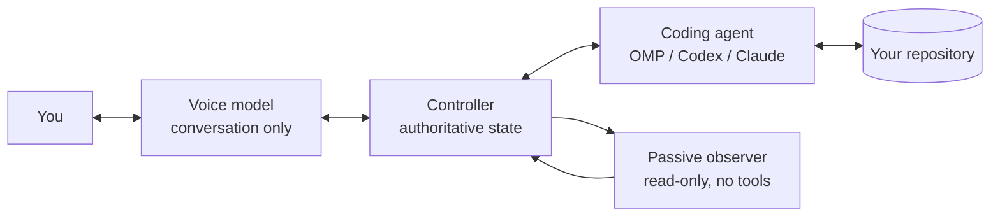

# Mamachi

**A local-first, voice-first coordination layer for coding agents.**

Mamachi lets you talk to your machine about repository work while a real coding
agent — [Oh My Pi](https://www.npmjs.com/package/@oh-my-pi/pi-coding-agent),
[Codex CLI](https://github.com/openai/codex), or
[Claude Code](https://docs.anthropic.com/en/docs/claude-code) — does the actual
coding. A realtime speech model handles the conversation. A deterministic local
daemon owns task state, permissions, and evidence. The two never mix.

Everything runs on your Mac. Your source never leaves it except through the
coding agent you already use, to the provider you already pay.

> **Status: pre-1.0.** The full loop works end to end and is dogfooded daily,
> but there are no signed release binaries yet — you build it yourself.
> See [`docs/status.md`](docs/status.md) for an honest capability matrix,
> including the parts of the design that are not implemented.

---

## Why this exists

Every coding agent couples conversation to its coding loop. You ask a question,
the loop stops. You want a status update, you read a tool trace. You change your
mind mid-task, you interrupt and lose the thread.

Mamachi splits those concerns apart:



- The **voice model** optimizes for low-latency conversation. It has no shell,
  no filesystem, no git, no edit tools. It cannot code, and it is told so twice
  in its own instructions.
- The **coding agent** optimizes for correct repository work and keeps running
  while you talk about something else.
- The **controller** is the only thing that can change task state. Model prose
  never does. Completion requires persisted evidence, not a claim.
- The **passive observer** turns bounded evidence into readable progress. It is
  structurally incapable of calling a tool or mutating state.

The practical result: you can ask "what's it doing?" and get an answer grounded
in what actually happened on disk, while the coding agent never pauses to answer
you.

---

## How we use it internally

Mamachi is not a replacement for Codex, Claude Code, or OMP. We still drive
those CLIs directly when we want to sit in a terminal and watch a diff land.

Mamachi is what we reach for when we *don't* want to sit there:

- **Dispatch without context-switching.** Describe a change out loud while
  reviewing something else. The task is queued against a pinned repository with
  an immutable identity; you keep your editor focus.
- **Queue depth.** One mutating job runs at a time, globally, by design. Extra
  requests stack up in a queue you can reorder by voice. Substantive coding work
  automatically jumps ahead of queued research and lookup tasks.
- **Status without trace-reading.** "How's it going" returns phase, changed
  files, verification state, and evidence — derived from the event log, not from
  the model's memory of what it said earlier.
- **Course correction that doesn't corrupt the run.** A consequential amendment
  pauses at the next safe tool boundary, records a new versioned task spec, and
  resumes the *same* backend session under it. Prior revisions are preserved.
- **Answering the coder.** When the agent asks a question, Mamachi relays it
  verbatim and will only forward an answer copied verbatim from your actual
  turn — no paraphrase, no invented reassurance.
- **Delegated lookups.** `inspect_workspace` and `research_web` spawn read-only
  fast tasks so "what does this module do" doesn't consume the mutating slot.

What we deliberately do *not* use it for: unattended work. Mamachi never
commits, never switches branches, never opens a PR, and never overwrites a file
you were already editing. It edits the working tree and stops.

---

## Where this is going

Near-term direction, roughly in order:

1. **One voice tool surface.** `packages/core/src/voice-toolkit.ts` is canonical
   (23 tools). `RealtimeBridge` still carries a near-duplicate 22-tool copy;
   collapsing the two is the largest outstanding cleanup and blocks clean
   third-engine support.
2. **Signed, distributable builds.** Packaging, hardened-runtime entitlements,
   and notarization already work; what is missing is a versioned bundle, an
   icon, and an update path.
3. **Editor-neutral clients.** The protocol is already editor-agnostic and
   codegen'd; the VS Code extension is just the first consumer.
4. **Daemon supervision from the app.** The daemon recovers its own state after
   a restart, but the app does not currently restart or re-attach to a crashed
   daemon.
5. **More backends and more engines.** Both are documented extension points —
   see [`CONTRIBUTING.md`](CONTRIBUTING.md).

Explicit non-goals: Windows/Linux clients, cloud workspaces, hosted accounts or
billing, multiple simultaneous mutating jobs, automatic branches/commits/PRs,
always-on background recording, and active reviewer agents that steer the coder
behind your back.

---

## Repository layout

| Path | What it is |
|---|---|
| `packages/protocol/` | Canonical JSON Schemas for every command and event, plus generated TypeScript and Swift bindings. Hand-written duplicate DTOs are prohibited. |
| `packages/core/` | The Bun/TypeScript daemon: controller, SQLite event store, policy, evidence gate, observer, workspace guard, voice bridges, coding-agent runners. |
| `apps/macos/` | SwiftUI menu-bar app: overlay, task drawer, audio, Keychain, onboarding, daemon supervision, packaging. |
| `apps/vscode/` | VS Code extension for workspace identity and *explicit* editor context capture. |
| `docs/` | [Architecture](docs/ARCHITECTURE.md), [product requirements](docs/product-requirements.md), [status](docs/status.md). |

---

## Requirements

- **macOS 14.0+** (Sonoma) for the app
- **Bun 1.3.14+**
- **Swift 6.0 toolchain** (Xcode 16+) for the macOS app
- At least one authenticated coding agent: `omp`, `codex`, or `claude`
- An **OpenAI API key** for voice. The cascade engine additionally needs an
  **ElevenLabs API key**.

Coding credentials are optional: Mamachi reuses your existing CLI logins and
never copies their tokens.

---

## Quick start

```bash
bun install
bun run typecheck
bun run test
```

### Run the daemon headless

```bash
bun run daemon
```

It prints a single JSON line on stdout — `{"type":"mamachi.ready","port":…,"token":…}` —
and serves `ws://127.0.0.1:47821/ws` behind `Authorization: Bearer <token>`.
State lands in `.mamachi/demo.sqlite` under the working directory. Copy
[`.env.example`](.env.example) to `.env` to override any of that.

There is also a scripted state-machine walkthrough with no providers attached:

```bash
bun run demo
```

### Build and run the macOS app

```bash
bun run macos:build      # → apps/macos/dist/Mamachi.app
bun run macos:run        # build, then open
```

The build compiles the Swift app, bundles the VS Code extension, compiles the
daemon into a single Bun executable, assembles the bundle, and signs it.

> **Sign with a persistent identity if you can.** In the default `auto` mode the
> script picks up a Developer ID or Apple Development identity automatically. If
> it finds neither, it warns and ad-hoc signs — and because an ad-hoc rebuild
> changes the code hash, macOS will re-prompt for Keychain access to
> `com.mamachi.app` items on every single rebuild.

```bash
MAMACHI_SIGN_MODE=developer-id \
MAMACHI_SIGN_IDENTITY="Developer ID Application: …" \
  bun run macos:build
```

### Updates

Mamachi has no background updater and makes no update-check requests. Until
signed binaries are published, update manually: fetch the desired tagged
revision, rebuild with `bun run macos:build`, quit Mamachi, and replace the old
application bundle. State and credentials remain in Application Support and the
Keychain, outside the bundle.

Published archives will include a sibling `.sha256` file. Verify one before
installing with `shasum -a 256 -c Mamachi-<version>-macos.zip.sha256`.

Maintainers create the signed, notarized archive and checksum in one command:

```bash
MAMACHI_SIGN_IDENTITY="Developer ID Application: …" \
MAMACHI_NOTARY_PROFILE="mamachi-notary" \
  bun run macos:release
```

### First run

Onboarding walks through microphone, notifications, Accessibility, VS Code,
the voice credential, and the coding backend. It will not let you finish without
a working coding agent, and it can install the bundled VS Code extension for you.

The wake gesture defaults to the **Fn / Globe** key: double-tap for hands-free,
hold for push-to-talk, tap again to barge in or sleep the mic. Bare modifiers
were chosen because they keep working under terminal Secure Keyboard Entry,
where combo hotkeys are swallowed. **⌥Space** is the fallback and needs no
Accessibility permission.

If macOS has the Globe key bound to emoji, input-source switching, or dictation,
Settings detects it and links straight to the relevant System Settings pane.

---

## How a task actually flows

1. You speak. The voice model collects intent — it never dispatches from
   hypotheticals or side conversation.
2. `submit_task` creates a durable task pinned to a repository identity and
   returns immediately. The coding agent starts independently; the voice model
   stays free to talk.
3. Every tool the agent runs passes through a risk policy *before* it executes.
   Routine work proceeds; destructive, publishing, deploying, purchasing, or
   out-of-repository effects raise a visual approval card; credential access and
   catastrophic commands are hard-rejected and recorded.
4. A workspace guard fingerprints the tree, tracks who wrote what, and blocks
   the agent from overwriting files you were already editing.
5. Each tool call becomes an evidence row. Completion requires persisted
   evidence from *that run*, and if any file changed, a successful verification
   command must have run *after* the last change. Otherwise the completion is
   rejected as `verification_incomplete`.
6. You get a spoken brief with the result, the verification, the caveat, and
   what to review. The drawer shows changed files, evidence, revisions, and
   deep links into VS Code.

Crash in the middle? On restart the run is marked interrupted, the recovery
boundary is recorded, the task lands `paused`, and nothing resumes until you
say so. An unknown in-flight tool call is never replayed.

---

## Privacy

- Raw microphone audio is never persisted.
- Text transcripts stay local until you clear them.
- With an encryption key configured, event payloads, commands, artifacts,
  evidence, observer notes, memories, and queued briefs are AES-256-GCM
  encrypted at rest, bound per row and column. The macOS app always supplies a
  Keychain-backed key. **A bare `bun run daemon` with no key stores plaintext.**
- Credentials live in the macOS Keychain and are stripped from the daemon's
  environment before any coding CLI is spawned.
- Diagnostics export is preview-first and allowlisted: no source, no
  transcripts, no prompts, no tool arguments, no credentials, no audio.
- The daemon accepts editor *metadata* by default. File contents, selections,
  diagnostics, and terminal excerpts cross over only on an explicit capture.

See [`SECURITY.md`](SECURITY.md) for the threat model and how to report issues.

---

## Contributing

Yes, please. [`CONTRIBUTING.md`](CONTRIBUTING.md) documents the three sanctioned
extension points — **a new coding backend**, **a new voice engine**, **a new
editor client** — with the exact files to touch for each, plus the protocol
codegen rules you must follow.

Start with [`docs/ARCHITECTURE.md`](docs/ARCHITECTURE.md). It is written for
someone who has never opened this repo.

By participating you agree to the [Code of Conduct](CODE_OF_CONDUCT.md).

---

## License

[MIT](LICENSE). Third-party notices for components redistributed inside the
macOS bundle are in `apps/macos/Resources/THIRD_PARTY_NOTICES.txt`.
