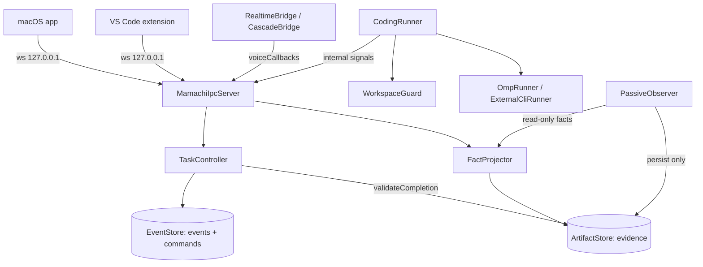

# Mamachi Architecture

Written for someone who has never opened this repository. Every symbol, path,
constant, and string literal below is real. Where the design document
([product-requirements.md](./product-requirements.md)) describes something the
code does not do, it is called out in [§11](#11-design-vs-implementation).

---

## 1. The one rule

> The SQLite event log is the only durable truth. `TaskController` is the only
> writer. Everything else is either a validated input or a derived projection.

Internalize that and the rest follows. There is no second source of truth, no
mutable state table, no cache the UI reads instead. In-memory state is a pure
fold of the persisted log, rebuilt by replay on boot.



Four processes/surfaces exist at runtime: the **Swift app** (which spawns
everything), the **Bun daemon**, the user's **coding CLI** (for Codex/Claude
backends), and **VS Code**.

---

## 2. Packages

| Package | Role |
|---|---|
| `packages/protocol` | Canonical JSON Schemas + Ajv validators + codegen. No runtime logic. |
| `packages/core` | The daemon. Controller, stores, policy, observer, voice bridges, coding runners. |
| `apps/macos` | SwiftUI app, audio, Keychain, packaging. Spawns and supervises the daemon. |
| `apps/vscode` | Editor client. Workspace identity + explicit context capture. |

---

## 3. Protocol (`packages/protocol`)

### 3.1 Source of truth

`packages/protocol/src/index.ts` holds hand-written `as const` JSON Schemas:

- `IdSchema` — UUIDv7 pattern, enforced on every command and event id
- `CommandSchema` — a `oneOf` over the **8** user-issuable commands
- `EventPayloadSchemas` — **24** domain event payloads
- `ActionResultSchema`, `TaskSpecSchema`, `EffectFingerprintSchema`,
  `DomainEventEnvelopeSchema`

Types are derived with `json-schema-to-ts`; validators are Ajv in
`strict: true, allErrors: true` mode, exposed as `parseCommand`,
`parseActionResult`, `parseDomainEvent`, and `ProtocolValidationError`.

Every schema is `additionalProperties: false`. An unknown field is a hard
validation error, not a warning. `protocol.test.ts` pins the important negative
cases — notably that `workspace.conflictDetected` rejects a `content` field,
because **source text must never enter an event payload**.

### 3.2 The command set

`task.submit`, `task.requestPause`, `task.revise`, `task.resume`,
`task.answerQuestion`, `task.cancel`, `queue.move`, `approval.resolve`.

Shape: `{id, type, actor, expectedRevision, payload}` where
`actor ∈ {user, voice, ui, vscode, coder}`. `expectedRevision` is `null` for
`task.submit`/`queue.move` and an integer ≥ 1 for the rest.

### 3.3 The event set

24 types: `task.created`, `task.enqueued`, `task.started`, `task.pauseRequested`,
`task.paused`, `task.awaitingUser`, `task.questionAsked`, `task.questionAnswered`,
`coder.sessionBound`, `coder.recoveryBoundary`, `task.specRevised`,
`task.resumed`, `task.completed`, `task.failed`, `task.cancelled`,
`run.interrupted`, `artifact.created`, `workspace.conflictDetected`,
`workspace.conflictResolved`, `policy.decisionRecorded`, `approval.requested`,
`approval.resolved`, `approval.consumed`, `queue.reordered`.

### 3.4 Codegen — the rule you must follow

`packages/protocol/scripts/generate-bindings.ts` derives command types from each
`oneOf` variant's `properties.type.const`, event types from
`Object.keys(EventPayloadSchemas)`, and a key-order-independent SHA-256 of the
canonical schema. It writes **four** files:

```
packages/protocol/generated/typescript/protocol.generated.ts
apps/vscode/src/generated/protocol.generated.ts              (byte-identical)
packages/protocol/generated/swift/MamachiProtocol.generated.swift
apps/macos/Sources/Mamachi/Generated/MamachiProtocol.generated.swift  (byte-identical)
```

**Never edit a generated file.** After any schema change:

```bash
cd packages/protocol && bun run bindings:generate
```

`packages/protocol/test/generated-bindings.test.ts` runs
`bun scripts/generate-bindings.ts --check` and fails the suite if any of the
four is stale. That is the drift detector; there is no other guard.

Adding a backend id, an event type, or a command type therefore always means
"edit the schema, regenerate, commit all four generated files".

---

## 4. Daemon control plane (`packages/core/src`)

### 4.1 Boot (`daemon.ts`)

An executable module with top-level `await` and no exports. Construction order
matters:

1. Validate `MAMACHI_TOKEN` (default: fresh UUIDv7) and `MAMACHI_PORT`
   (default `47821`; throws on a non-integer or out-of-range value).
2. Resolve `MAMACHI_STATE_PATH` (default `.mamachi/demo.sqlite`), create its
   parent.
3. Read `MAMACHI_ENCRYPTION_KEY` and the provider keys.
4. `await discoverAuthStorage()` from `@oh-my-pi/pi-coding-agent`, then
   `setRuntimeApiKey` per provider.
5. **Delete** `MAMACHI_ENCRYPTION_KEY`, `MAMACHI_TOKEN`, `ANTHROPIC_API_KEY`,
   `OPENAI_API_KEY`, `GEMINI_API_KEY`, `MAMACHI_ELEVENLABS_API_KEY` from
   `process.env`. This matters: `external-cli-runner.ts` copies *all* of
   `process.env` into every spawned child.
6. `VoiceBriefStore`, `MacComputerController`.
7. `new MamachiIpcServer(...)` — this brings up the entire control plane and
   **starts listening immediately**.
8. `voiceCallbacks`, then *both* voice bridges (`RealtimeBridge` and
   `CascadeBridge`); only the one named by `runtimeSettings.voiceEngine` holds
   provider sockets.
9. `OmpObserverBackend` → `PassiveObserver`.
10. `CodingRunner` with its full callback bundle.
11. `await daemon.recoverAfterRestart()`.
12. Write the connection descriptor (`0700` dir, `0600` file, tmp + rename).
13. Print `{"type":"mamachi.ready",...}` on **stdout**. All other logging goes
    to stderr.

Note the consequence of 7 before 11: a client that connects in that window sees
the pre-recovery snapshot, then receives the recovery events as `domain.event`s.

Full environment variable reference: [`.env.example`](../.env.example).

### 4.2 Commands, idempotency, revisions (`controller.ts`, `event-store.ts`)

`EventStore.executeCommand(command, decide)` runs one `transaction.immediate()`:

1. `SELECT result_json FROM commands WHERE id = ?`. On a hit it returns the
   stored `ActionResult` and **never invokes `decide`** — a retried command
   cannot double-append events.
2. Otherwise `decide()` yields `{result, events}`.
3. Events insert into `events`; `seq` comes from SQLite `AUTOINCREMENT`. Each
   row is re-validated through `parseDomainEvent` before being handed back.
4. The `commands` row is written with encoded payload and result.

A throwing `decide()` rolls back both.

Commands are validated **twice** on the IPC path: `MamachiIpcServer.executeCommand`
calls `parseCommand` before its own workspace checks, and `TaskController.handle`
calls it again. `TaskController` is therefore safe to drive directly, which is
what `demo.ts` and the tests do.

`TaskRecord.revision` starts at 1 and increases only via `task.specRevised`.
`#checkRevision` returns `{status:"conflict", currentRevision, explanation}` with
**no events** on a mismatch. Revision binding runs deeper than the command
check: questions and confirmations carry `taskRevision`, and `task.specRevised`
marks every open question of that task `superseded`. A spec change invalidates
in-flight questions and approvals rather than carrying them forward.

`ActionResult` has exactly four shapes: `accepted`, `confirmation_required`,
`rejected`, `conflict`.

### 4.3 `internal.*` are commands, not events

They never appear in `EventPayloadSchemas`. They are `commands.type` values that
give non-user signals the same transaction and dedupe treatment:

| Command | Controller method | Raised by |
|---|---|---|
| `internal.safeBoundaryReached` | `pauseAtSafeBoundary` | `CodingRunner.onSafePause` |
| `internal.task.questionAsked` | `awaitUserInput` | `onNeedInput` |
| `internal.coder.sessionBound` | `recordCoderSession` | `onSessionBound` |
| `internal.policy.authorizeTool` | `authorizeToolCall` | `onAuthorizeTool` |
| `internal.artifact.recorded` | `recordArtifact` | `recordToolEvidence` |
| `internal.workspace.conflict` | `reportWorkspaceConflict` | `onWorkspaceConflict` |
| `internal.task.completed` / `.failed` | `#finishTask` | `onComplete` / `onFail` |
| `internal.recoverAfterRestart` | `recoverAfterRestart` | `daemon.ts` at boot |

Evidence recording is the one internal path with a *stable* idempotency key: it
passes `artifact.id` as the signal id, so an artifact can never double-record.

### 4.4 The reducer (`domain.ts`)

`applyEvent` throws on a non-contiguous sequence and runs
`assertStateInvariants` after **every** event:

- no duplicate queue ids; every queued id exists and is `queued`
- `activeTaskId`, if set, names a task in `running | pause_requested | paused |
  awaiting_user` and not simultaneously queued
- `activeRunId` resolves to a run of that task in `running` or `interrupted`
- at most one `open` question per task, and an open question implies
  `awaiting_user`
- `specHistory.at(-1).revision === task.revision`

`snapshotState` deep-copies with `structuredClone`, so no consumer can mutate
controller state through a snapshot.

### 4.5 Task lifecycle

States: `queued | running | pause_requested | paused | awaiting_user |
completed | failed | cancelled`. A **run** is one execution segment under one
task-spec revision; every resume, answer, and approval mints a fresh `runId`.

**One mutating job, globally.** Three mechanisms enforce it: `activeTaskId` is a
single slot; `#submit` only emits `task.started` when the slot is free; and
handoff is atomic — `#finishTask` and `#cancel` emit the next task's
`task.started` *in the same transaction* as the terminal event. No scheduler
tick, no race window.

**Queue priority.** A task with `spec.codingProfileId === "fast"` appends to the
end. Anything else inserts before the first queued fast task, so substantive
coding work jumps ahead of research and lookups.

**Pause is two-phase, never preemptive.** `task.requestPause` →
`pause_requested`. The runner keeps going until a safe tool boundary, signals
`internal.safeBoundaryReached`, and only then does `task.paused` land.

**Amend.** `task.revise` requires `paused | awaiting_user` and refuses to change
`spec.repositoryId` (`repository_immutable`). A task can never be retargeted at
another repo.

**Resume** refuses while an open question (`question_pending`) or a pending
confirmation at the current revision (`confirmation_pending`) exists. If a
workspace conflict is open, resuming emits `workspace.conflictResolved` first —
resuming *is* the reconciliation act, and it is recorded.

**Recovery.** `recoverAfterRestart` emits, in one transaction: `run.interrupted`,
then `coder.recoveryBoundary {unknownToolCall: true}` if a coding session was
bound, then `task.paused {reason: "recovery requires explicit resume"}`. Nothing
resumes implicitly and no in-flight tool call is ever replayed.

### 4.6 Persistence

One SQLite file, opened independently by `EventStore`, `ArtifactStore`,
`MemoryStore`, and `VoiceBriefStore`. WAL mode for any non-`:memory:` path.

Live tables: `commands`, `events`, `context_artifacts`, `artifacts`,
`observer_interpretations`, `memories`, `projects`, `schema_migrations`, and
`voice_briefs` (the last created ad-hoc by its own store, outside the migration
system).

> Migration v2 also creates `voice_sessions`, `transcript_turns`,
> `intent_drafts`, `tasks`, `task_spec_revisions`, `runs`, `confirmations`, and
> `questions`. **Nothing reads or writes any of them.** They are the design
> document's proposed relational model; the implementation keeps all of it in
> the event log. Do not assume a second source of truth.

`migrateStorage(db)` creates `schema_migrations(version, applied_at)` and
applies each unapplied entry of the ordered `migrations` array inside its own
transaction. Versions are tracked by row presence, not by `PRAGMA user_version`.
`STORAGE_SCHEMA_VERSION = 2` is documentation, not a guard.

**Never edit an applied migration.** Append `{version: 3, sql}`.

### 4.7 Field encryption (`sensitive-field-codec.ts`)

AES-256-GCM, 12-byte nonce, 16-byte tag. Envelope:

```
mamachi:aes256gcm:v1:<nonceB64>.<tagB64>.<ciphertextB64>
```

The **AAD binds the ciphertext to its exact row and column**:
`mamachi:aes256gcm:v1:<table>.<column>:<row-id>`. Copying a blob between rows
fails authentication. Every failure path throws; there is no silent fallback.

Encrypted: `events.payload_json`, `commands.payload_json`,
`commands.result_json`, `context_artifacts.summary`/`.payload_json`,
`artifacts.summary`/`.payload_json`, `observer_interpretations.summary`/
`.risks_json`/`.next_step`, `memories.content_ciphertext`,
`voice_briefs.summary_ciphertext`/`.notification_ciphertext`.

Not encrypted (needed for indexed queries): ids, timestamps, `type`, `actor`,
`project_id`/`task_id`/`run_id`, `tool_name`, `tool_call_id`, `kind`,
`successful`, `model`.

**With no key the codec is a passthrough** and everything is plaintext. That is
the supported development mode. The macOS app always supplies a Keychain key.

When a key first appears, each store upgrades its own legacy plaintext rows in
one transaction at construction. `EventStore.#migrateLegacyCodingSessions` runs
unconditionally, backfilling `backend: "omp"` into pre-multi-backend
`coder.sessionBound` payloads so old logs still replay.

### 4.8 IPC (`ipc-server.ts`)

**Loopback TCP WebSocket**, not a Unix socket. `Bun.serve` on `127.0.0.1`.

- `GET /health` → `{status:"ok", version:1}`, unauthenticated liveness probe
- `/ws` requires `Authorization: Bearer <token>`, compared with
  `timingSafeEqual`
- anything else → 404

Text frames are `{version:1, id, type, payload}` against a **15-type allowlist**:
`state.get`, `workspace.select`, `workspace.focus`, `editor.state`,
`context.capture`, `context.remove`, `command.execute`, `settings.update`,
`voice.connect`, `voice.disconnect`, `voice.engagement`, `voice.interrupt`,
`voice.text`, `voice.mode`, `editor.context.response`.

Binary frames are raw PCM audio, both directions.

Every request gets exactly one response. A thrown error becomes
`{ok:false, error}` — a bad request never tears down the socket.

**Snapshot + sequence replay.** On open the server sends `server.ready` with a
complete snapshot. After any mutation it emits each new `domain.event`, then one
`state.snapshot`, so clients may fold events or take the snapshot and both are
consistent. `state.get {afterSeq}` is the reconnect path; `reset: true` tells a
stale client (one whose sequence is *ahead* of the store) to rebuild from the
snapshot. Replay is clamped to `seq <= snapshot.seq`.

**Boundary checks worth knowing.** `task.submit` requires
`payload.repositoryId` to equal the selected workspace and every attachment id
to resolve inside it, both *before* the controller sees the command.
`editor.state` accepts metadata only — `{workspace, path, version, dirty, open}`
— never document content. Captured context is capped at 128 KiB. Screenshots
must be an absolute `.png`/`.jpg`/`.jpeg` path and are copied into
`<state-dir>/screenshots/` at mode `0700`. `getTaskArtifact` returns null unless
the artifact's `taskId` matches, so cross-task reads are impossible from the
voice layer.

### 4.9 Policy (`policy.ts`)

`assessToolCall(toolName, input, repository)` is a strict **first-match ladder**
returning `tier ∈ {automatic, visual_approval, reject}`:

| # | Trigger | Outcome |
|---|---|---|
| 1 | `rm -rf /`, `mkfs`/`diskutil eraseDisk`, fork bomb | **reject** / `unsupported` |
| 2 | credential access: `*_API_KEY`, `MAMACHI_TOKEN`, `AWS_*`, `GITHUB_TOKEN`, `.env`, `.ssh/`, `id_rsa`, `security find-*-password`, bare `env`/`printenv`/`export` | **reject** / `credential_access` |
| 3 | purchase / checkout / `stripe payment` | approval / `purchase` |
| 4 | `npm\|bun\|cargo\|gem\|pypi\|twine publish`, `gh release create\|upload`, `gh pr create`, `git push` | approval / `external_publication` |
| 5 | `vercel\|netlify\|fly\|railway\|firebase deploy`, `kubectl apply`, `terraform apply` | approval / `deployment` |
| 6 | `git reset --hard`, `clean`, `restore`, `checkout --`, `switch`, `branch -D`, `rebase`, `commit`, `push`, `tag -d` | approval / `destructive_git` |
| 7 | `rm`, `shred`, `dd`, `chmod -R`, output redirection | approval / `destructive_filesystem` |
| 8–10 | any cwd or path outside the repository | approval / `outside_repository` |
| 11 | `browser` `run` with `.click(`/`.type(`/`.fill(`/`.uploadFile(`/`.select(` | approval / `external_publication` |
| 12 | fallthrough | **automatic** / `routine` |

`fingerprintToolEffect` = `sha256(toolName ‖ "\0" ‖ canonicalJson(input))` with
recursively sorted keys. Argument *order* is irrelevant; any argument *value*
change produces a different fingerprint.

`TaskController.authorizeToolCall` is the only place a decision becomes durable.
Approvals are **revision-bound, fingerprint-bound, and single-use**:
`pending → approved|rejected → consumed`. A hard rejection still appends
`policy.decisionRecorded` so it stays auditable.

`ArtifactStore.recordToolEvidence` calls `assessToolCall` a *second* time, for
redaction rather than permission: any non-routine category replaces the stored
argument summary with `[<category> arguments omitted]`, and `credential_access`
additionally drops the result.

### 4.10 Evidence gating (`artifact-store.ts`, `fact-projector.ts`)

Each tool call becomes one row classified as:

- **`file_change`** — `changedFiles` non-empty, either observed by
  `WorkspaceGuard` or, for declared mutators (`edit`, `write`, `ast_edit`,
  applying `lsp` actions), extracted from the tool input
- **`verification`** — `bash` whose command matches standalone
  `test|tests|typecheck|check|build|lint|verify`, or `pytest`, `swift test`,
  `cargo test`, `go test`, `bun test`, `npm test`, `tsc`
- **`tool_result`** — everything else

Result excerpts cap at 32 768 chars, input summaries at 1 000. The AUTOINCREMENT
`ordinal` is the happens-before ordering everything else keys on.

`validateCompletion` permits completion only if **all** hold:

1. `evidenceIds` is non-empty and every id resolves to a persisted row
2. every artifact's `taskId` **and** `runId` match the finishing run
3. at least one artifact is successful
4. if any successful `file_change` exists, at least one successful
   `verification` has `ordinal >` the last file change

Otherwise `#finishTask` returns `rejected` / `verification_incomplete`. The
**default** validator, used when none is supplied, refuses everything — the gate
fails closed.

`FactProjector` derives phase, progress, changed files, verification state,
current step, and recent activity deterministically from those rows.
`observerInterpretation` is kept in its **own field** and never merged into
derived facts, so model prose and machine truth stay separable all the way to
the UI.

### 4.11 Passive observer (`observer.ts`)

Receives an `ObserverPacket` containing only a `Pick<TaskFacts, …>` — phase,
progress, currentStep, implementation/verification state, changedFiles,
verification summaries, recent activity. No raw tool output, no file contents,
no transcripts.

It cannot do damage, structurally:

- **No tools.** `OmpObserverBackend` installs an extension that hooks
  `tool_call`, calls `context.abort()`, and returns
  `{block: true, reason: "The passive observer cannot execute tools"}`. The
  session is created with `autoApprove: false, hasUI: false, enableMCP: false,
  enableIrc: false`.
- **No state mutation.** `PassiveObserver` is constructed with exactly three
  capabilities: `backend`, `persist` (writes only `observer_interpretations`),
  and `emit`. It holds no controller reference and no command path.
- **No free-form output.** `parseObserverDraft` requires
  `{summary: string, risks: string[], nextStep: string|null}` and clamps every
  field, server-side too.
- **No control-path latency.** `observe()` is fire-and-forget, coalescing bursts
  per task. Failures emit `observer.error` and are otherwise swallowed.

### 4.12 Workspace guard (`workspace-guard.ts`)

`start()` fingerprints the tree — `git ls-files -co --exclude-standard -z`,
falling back to a glob — as `"<mode>:<size>:<sha256>"` per file, and records
pre-existing modifications from `git status --porcelain`.

`beforeTool` classifies the tool's mutation scope and blocks when targets
overlap dirty editor buffers, external changes, or pre-existing user work. This
is why an anchored `edit` to a user-modified file is allowed while a whole-file
`write` to the same file is blocked.

`afterTool` diffs against that tool's baseline and subtracts any path whose
editor version changed mid-call — those become a conflict
(`"The user edited a target while the coding tool was running"`); the remainder
is attributed to the agent and becomes `ToolEvidenceInput.changedFiles`. That is
how a plain shell command that happens to write files still yields `file_change`
evidence.

External CLIs can't be intercepted per tool, so `beginExternalTurn` /
`endExternalTurn` model the whole turn as an unbounded mutator and refuse to
start at all while any external change or dirty buffer exists.

Mamachi never locks files.

### 4.13 Model router (`model-router.ts`)

`RuntimeSettings` has exactly ten fields: `codingBackend`, `primaryModel`,
`fastModel`, `thinkingLevel`, `automaticRouting`, `computerCapabilities`,
`computerConfirmationMode`, `voiceEngine`, `cascadeReasoningEffort`,
`cascadeVoiceId`. `parseRuntimeSettings` is an exact-shape validator — no more
keys, no fewer — and is the only entry point for `settings.update`.

`resolveTaskRoute` picks a **model**, never a backend. The backend comes only
from `MAMACHI_CODING_BACKEND` at boot or from `settings.update`.

---

## 5. Coding backends (`coding-runner.ts` + runners)

### 5.1 The interface

```ts
interface CodingBackendRunner {
  configure(settings: RuntimeSettings): void;
  updateEditorState(state: EditorDocumentState): void;
  askCoder(taskId: string, question: string): Promise<boolean>;
  steer(taskId: string, clarification: string): Promise<boolean>;
  followUp(taskId: string, addition: string): Promise<boolean>;
  handleEvents(events: readonly DomainEvent[]): void;
  dispose(): Promise<void>;
}
```

It is **structural, not nominal** — neither `OmpRunner` nor `ExternalCliRunner`
declares `implements`; they satisfy it by shape. It is not exported.

`handleEvents` is the *only* way a runner is driven. Runners are event
consumers; nothing calls them to "start work".

### 5.2 Dispatch

`CodingRunner` holds `Record<CodingBackend, CodingBackendRunner>`, built eagerly
— all backends live for the whole daemon lifetime, one is `#activeBackend`.
On `task.started`/`task.resumed`, a task with a persisted
`codingSession.backend` **pins** to it; otherwise `RuntimeSettings.codingBackend`
decides. A task never silently migrates between backends or accounts.

### 5.3 Embedded OMP (`omp-runner.ts`)

`createAgentSession()` from `@oh-my-pi/pi-coding-agent`, with
`autoApprove: true, hasUI: false, enableMCP: false, enableIrc: false`. An
`executionGuardExtension` registers the `ask_coder` and `finish_coder` tools and
hooks `pi.on("tool_call")`: pause check → bypass for those two tools →
`onAuthorizeTool` → `WorkspaceGuard.beforeTool`, blocking with
`{block: true, reason}` + `context.abort()`.

**Interception happens before execution.** Driven via `session.prompt`,
`followUp`, `steer` (requires an active stream), and `abort({reason})`.

### 5.4 Codex CLI and Claude Code (`external-cli-runner.ts`)

Executable resolution: `MAMACHI_CODEX_PATH`/`MAMACHI_CLAUDE_PATH` → `Bun.which`
→ `~/.local/bin`, `~/.bun/bin`, `~/.npm-global/bin`, `~/.claude/local`,
`/opt/homebrew/bin`, `/usr/local/bin`, `~/.nvm/versions/node/*/bin`.

```
codex   exec --json + workspace-write sandbox + PreToolUse hook
claude  -p --output-format stream-json + PreToolUse hook
```

Prompt on stdin, NDJSON on stdout, `NO_COLOR=1`/`TERM=dumb`. Session ids are
persisted and resumed in the original repository. Each turn starts an
authenticated loopback policy service; native `PreToolUse` hooks synchronously
submit every proposed tool call to `assessToolCall` and deny on service failure.
The CLIs retain their native workspace sandbox as a second boundary.

**Delivery decides Git and network reach, not prose.** `TaskSpec.delivery`
(`working_tree` | `commit` | `pull_request`, absent ⇒ `working_tree`) is the
single gate. `deliveryOf(task)` drives three escalations, each narrower than the
last:

- `commit` and `pull_request` add `--add-dir <repo>/.git` and
  `sandbox_workspace_write.writable_roots=[…/.git]`, so staging/commit can write
  `.git`.
- `pull_request` additionally sets `sandbox_workspace_write.network_access=true`
  — the `workspace-write` sandbox denies network otherwise, so `git push` would
  fail before the policy hook ran. Every command still passes the `PreToolUse`
  hook, and `git push` / `gh pr create` each park their own approval card
  (policy rule 4).

This replaced a regex that granted `.git` write whenever the objective or an
acceptance criterion contained the word "commit"/"stage": phrasing could grant
privilege. Now only the accepted specification's `delivery` can.

### 5.5 Adding a fourth backend

1. Add the id to `codingBackends` in `model-router.ts`.
2. Write `packages/core/src/<name>-runner.ts` matching the 7-member shape and
   accepting the same callback bundle.
3. Add the key to `CodingRunner.#runners` — `Record<CodingBackend, …>` makes
   this a compile error until you do.
4. Widen `EventPayloadSchemas["coder.sessionBound"].properties.backend.enum` in
   `packages/protocol/src/index.ts`, or `parseDomainEvent` rejects the session
   binding at runtime.
5. `cd packages/protocol && bun run bindings:generate`.
6. Widen the three hand-written literal unions that are **not** derived from
   `codingBackends`: `CodingSessionRecord.backend` (`domain.ts`),
   `recordCoderSession` (`controller.ts`), `recordCoderSession`
   (`ipc-server.ts`).
7. Export the runner from `packages/core/src/index.ts`.
8. Thread any executable path or credential through `daemon.ts`.
9. macOS surface: `CodingAgentBackend`, `CodingAgentDiscovery.executable(for:)`,
   `status(for:storedProviders:)`, `setupScript(for:executablePath:)`.

---

## 6. Voice layer

### 6.1 The abstraction (`voice-bridge.ts`)

Pure contract plus constants; it imports neither bridge. Start here.

- `voiceEngines = ["realtime", "cascade"]` — `parseRuntimeSettings` derives its
  validation from this
- `interface VoiceBridge` — 12 members the daemon drives: `connect`,
  `disconnect`, `appendAudio`, `setEngaged`, `interrupt`, `setResponseMode`,
  `sendText`, `captureContext`, `discardContext`, `handleTaskEvents`,
  `noteHarnessEvent`, `refreshComputerControlConfiguration`
- `interface VoiceHostCallbacks` — daemon capabilities handed to a bridge
- `interface VoiceToolHost extends VoiceHostCallbacks` — the only four bridge
  internals a tool executor may touch: `isEngaged`, `getResponseMode`,
  `sleepMicrophone`, `attachUserImage`
- `VoiceToolkit` / `VoiceToolkitFactory` / `VoiceFunctionTool`

`VoiceFunctionTool` is deliberately the OpenAI *Responses* shape, which the
Realtime API also accepts — one definition serves both engines.

### 6.2 The two engines

**`CascadeBridge implements VoiceBridge`** — ElevenLabs Scribe v2 Realtime STT →
OpenAI Responses (`gpt-5.5`, reasoning effort `none`) → ElevenLabs Flash v2.5
TTS.

**`RealtimeBridge implements VoiceBridge`** — OpenAI Realtime WebSocket, 24 kHz
duplex PCM, server VAD, `create_response: false` so the bridge drives generation
itself.

Both construct the canonical toolkit once with `createVoiceToolkit`; provider
transport, audio/history behavior, and conversion between provider function
calls and `VoiceToolkit.execute` stay inside each bridge.

### 6.3 The tool surface (`voice-toolkit.ts`)

23 tools, exposed identically by both engines and pinned by cross-engine parity
tests.

| Tool | Mutates controller state |
|---|---|
| `wait_for_user`, `get_workspace`, `list_coding_profiles`, `get_task_status`, `get_task_artifact`, `ask_coder`, `set_overlay`, `look_at_screen`, `mute_mamachi` | no |
| `capture_editor_context`, `capture_screen_context` | creates artifacts |
| `submit_task`, `answer_task_question`, `propose_task_change`, `control_task`, `manage_queue`, `resolve_confirmation`, `remember_fact`, `forget_fact`, `inspect_workspace`, `research_web` | **yes** |
| `control_computer`, `resolve_computer_control` | mutates the Mac, not the controller |

Every schema is `additionalProperties: false`.

**What the voice model cannot do.** There is no tool for reading a file, writing
or editing a file, listing a directory, running git, running tests, or running a
build. Its instructions say so twice. All repository work is delegated through
`submit_task`, `inspect_workspace`, `research_web`, and `ask_coder`.
`submit_task` carries an optional `delivery` (`working_tree` | `commit` |
`pull_request`); the instructions forbid the model from upgrading it on its own
or claiming a pull request exists without a tool result carrying its URL, and
require one call per repository rather than a batch form ([§5.4](#54-codex-cli-and-claude-code-external-cli-runnerts)).

The one escape hatch is `control_computer` with `run_shell_command` (`/bin/zsh
-lc`) or `run_applescript`. Both are gated on the `shell` / `apple_script`
capabilities, **neither of which is in the default
`assistiveComputerCapabilities`**, and both are in `sensitiveComputerActions`,
so under the default `computerConfirmationMode: "sensitive"` they park a
confirmation instead of running. Out of the box the voice model has no shell.

### 6.4 Turn lifecycle

Realtime `setEngaged(false)` keeps the provider socket open and suppresses
audio; cascade closes the Scribe socket but stays connected. Both queue briefs
while asleep and flush them on re-engagement.

Barge-in truncation differs by necessity. Realtime sends
`conversation.item.truncate` with the exact `audio_end_ms` the app reported, and
the provider edits its own history. Cascade has no server history, so it
accumulates Flash's chunk-relative character alignment into an absolute timeline
and truncates the local conversation to exactly the audio that reached the
speaker.

Provider transcription stays **provisional** until Mamachi accepts the turn.
Speech heard while disengaged, or discarded by `wait_for_user`, never appears as
user text.

### 6.5 Adding a third voice engine

1. Append the id to `voiceEngines` in `voice-bridge.ts`.
2. Write `packages/core/src/<engine>-bridge.ts` exporting
   `class <Engine>Bridge implements VoiceBridge`. **Model it on `CascadeBridge`,
   not `RealtimeBridge`.**
3. Define `<Engine>BridgeOptions extends VoiceHostCallbacks` with `emitAudio`,
   `createToolkit: VoiceToolkitFactory`, provider keys, and endpoint overrides
   as test seams.
4. Build the toolkit once, in the constructor, from `createVoiceToolkit`. Do not
   hand-roll a tool surface.
5. Wire the dispatch site in `daemon.ts` (`activeVoice()` and the
   engine-switch branch of the settings-update hook).
6. Follow `cascade-bridge.test.ts`: mock provider servers, assert the turn loop,
   tool round-trips, alignment truncation, text mode, briefs, error taxonomy.

---

## 7. macOS app (`apps/macos`)

SwiftPM, Swift tools 6.0, `.macOS(.v14)`, no external package dependencies.
`LSUIElement` — menu-bar agent, no Dock icon. Not sandboxed.

| File | Owns |
|---|---|
| `MamachiApp.swift` | `@main`, `MenuBarExtra`, `AppDelegate`, wiring |
| `AppModel.swift` | All published UI state, IPC dispatch, command envelopes, Keychain wrappers |
| `DaemonProcess.swift` | Locating, launching, and handshaking with the embedded daemon |
| `IpcClient.swift` | `URLSessionWebSocketTask` client; binary frames are PCM |
| `KeychainStore.swift` / `EncryptionService.swift` | Credentials and the application encryption key |
| `KeyActivation.swift` | The clock-injected wake-gesture state machine |
| `GlobalHotKey.swift` | Carbon ⌥Space fallback |
| `OverlayPanelController.swift` / `OverlayView.swift` | Non-activating overlay panel |
| `Onboarding.swift` / `CodingAgentSetup.swift` | First run, backend detection and install |
| `Diagnostics.swift` | Allowlisted, previewable diagnostics export |

**Daemon supervision.** `DaemonProcess` finds `runtime/mamachi-daemon` inside
the bundle (or `MAMACHI_DAEMON_PATH`), injects the token, port `0`, encryption
key, provider keys, and CLI paths, then parses the `mamachi.ready` stdout line
for the ephemeral port and token.
After readiness it drains both pipes, watches termination, and relaunches with
bounded backoff. Each successful restart publishes a fresh port/token to
`AppModel`, which reconnects IPC and requests a state replay. Repeated early
crashes exhaust the restart budget and become a visible terminal failure.

**Wake gestures.** `ActivationKey` defaults to `.fn`. `ActivationGestureMachine`
uses `doubleTapWindow = 0.35 s` and `holdThreshold = 0.25 s`. Double-tap engages
hands-free **on the second key-down** (saving ~100 ms). A lone tap is
deliberately a no-op so stray Fn presses never wake the mic. Push-to-talk fires
without waiting for release and survives other keypresses — people type while
talking. Combos poison an in-flight press.

Bare modifiers ride `flagsChanged`, which keeps flowing under terminal Secure
Keyboard Entry where combo hotkeys are swallowed. That is the whole reason for
the design. `KeyActivationMonitor` requires `AXIsProcessTrusted()`; without it,
⌥Space still works.

**Permissions.** Microphone (degrades to text mode), Notifications (degrades to
in-app state only), Accessibility (degrades to ⌥Space only). The bundle declares
its Apple Events purpose for explicitly enabled `apple_script` control. Screen
Recording and Full Disk Access are not requested.

### 7.1 Packaging (`build-app.sh`)

Signs, builds Swift release, bundles the VS Code extension, compiles the daemon
to a single Bun executable, assembles, signs, optionally notarizes and staples.

```
Mamachi.app/Contents/
  Info.plist
  MacOS/Mamachi
  Resources/THIRD_PARTY_NOTICES.txt
  Resources/AppIcon.icns
  Resources/runtime/mamachi-daemon        (Bun single-file, entitled)
  Resources/runtime/daemon-version.json
  Resources/vscode-extension/package.json
  Resources/vscode-extension/dist/extension.js
```

Those paths are load-bearing — `DaemonProcess`, `DiagnosticsService`, and
`installBundledVSCodeExtension` each depend on one of them.

`MAMACHI_SIGN_MODE` accepts `auto | adhoc | none | developer-id`. In `auto` the
script prefers a Developer ID identity, then Apple Development, then warns and
ad-hoc signs. The daemon binary alone receives `Daemon.entitlements`
(`allow-jit`, `allow-unsigned-executable-memory`,
`disable-executable-page-protection`, `allow-dyld-environment-variables`,
`disable-library-validation`) because Bun JITs.

`VERSION` is canonical. `scripts/check-version.ts` keeps package manifests and
the source plist aligned; `build-app.sh` writes the selected version and build
number into the assembled plist and daemon diagnostics. `release-app.sh`
requires Developer ID and notary credentials, staples the bundle, and emits a
versioned archive plus SHA-256 checksum.

---

## 8. VS Code extension (`apps/vscode`)

Activates `onStartupFinished`. `MamachiBridge` reads the connection descriptor
from `MAMACHI_CONNECTION_PATH` or
`~/Library/Application Support/Mamachi/connection.json`, connects to
`ws://127.0.0.1:<port>/ws` with the Bearer token, and reconnects with a capped
backoff of `[250, 500, 1000, 2000, 4000, 5000]` ms.

`#synchronize` sends `state.get {afterSeq}`, rejects a backwards snapshot,
replays events above `snapshot.seq`, then drains buffered live events.
At-most-once delivery comes from an LRU id set (2048) plus a monotonic sequence.

Contributed commands:

| Command | Captures |
|---|---|
| `mamachi.captureActiveFile` | active file, ≤ 96 000 chars |
| `mamachi.captureSelection` | selection, ≤ 96 000 chars |
| `mamachi.captureDiagnostics` | ≤ 100/200 diagnostics |
| `mamachi.captureTerminalSelection` | ≤ 32 000 chars, behind a modal confirm |
| `mamachi.focusWorkspace` | pins this workspace |
| `mamachi.showStatus` | connection state |

Continuously and automatically, the extension sends **metadata only**:
`{workspace, path, version, dirty, open}`. Document content crosses over only
through an explicit capture command.

---

## 9. Testing

```bash
bun run check                       # typecheck + versions + TS/Swift tests + protocol drift
```

The suites are behavioral: they pin the completion gate rejecting cross-run
evidence, the policy ladder's exact ordering, effect fingerprints binding to
exact arguments, recovery never resuming implicitly, the guard permitting
anchored edits but blocking whole-file overwrites, the observer coalescing off
the control path, the VS Code backoff sequence, and the cascade's alignment
truncation.

---

## 10. Where to make a given change

| Change | Files, in order |
|---|---|
| New user command | `protocol/src/index.ts` `CommandSchema` → `TaskController.#decide` + handler → `domain.ts applyEvent` + invariants → regenerate bindings → `controller.test.ts` |
| New domain event | `EventPayloadSchemas` → `domain.ts applyEvent` case → regenerate bindings |
| New IPC request | `RequestEnvelope` union **and** the `supported` set in `parseRequest` **and** `#dispatch` — all three, or it is rejected |
| New table or column | append `{version: 3, sql}` to `migrations`; never edit an applied one |
| New encrypted field | route through `SensitiveFieldCodec` with a `<table>.<column>:<row-id>` label, plus a legacy-upgrade pass |
| New risky-tool rule | `policy.ts assessToolCall` (mind first-match ordering) + `policy.test.ts` |
| New evidence classification | `recordToolEvidence` **and** `validateCompletion` **and** `FactProjector` — they must stay in lockstep |
| New status surface | `FactProjector`. Facts are derived, never stored. |
| New env var or wiring | `daemon.ts` only. `MamachiIpcServer` reads no environment. |
| New coding backend | [§5.5](#55-adding-a-fourth-backend) |
| New voice engine | [§6.5](#65-adding-a-third-voice-engine) |
| New daemon → UI event | add a case to `AppModel.handle(_:)` |

---

## 11. Design vs. implementation

The product requirements document describes intent. These parts are **not**
implemented as written:

1. **Unix-domain socket, length-prefixed frames.** Neither exists. It is a
   loopback TCP WebSocket with Bearer auth and standard framing. The rest of
   that section — versioned JSON, a distinct binary frame kind, a per-launch
   authenticated handshake, reconnect from a durable sequence — is implemented.
2. **~20 catalogued domain events have no schema and no emitter**, including
   `intent.updated`, `task.phaseChanged`, `plan.updated`, `step.started`,
   `decision.recorded`, `blocker.raised`, `verification.started`, and the
   `voice.*` lifecycle events. Phase is not an event at all; it is derived by
   `FactProjector`.
3. **Eight relational tables are created and never used** — see [§4.6](#46-persistence).
   Intent drafts have no implementation anywhere.
4. **`steerCoder` / `followUpCoder` are wired in `daemon.ts` but no voice tool
   calls them.** Dead capability today.
5. **External backends return `false` from `askCoder`/`steer`/`followUp`.**
   Live steering is an OMP-only capability; external CLIs stop at process
   boundaries instead.

Keep this list honest. If you close one of these, delete the entry in the same
pull request.
